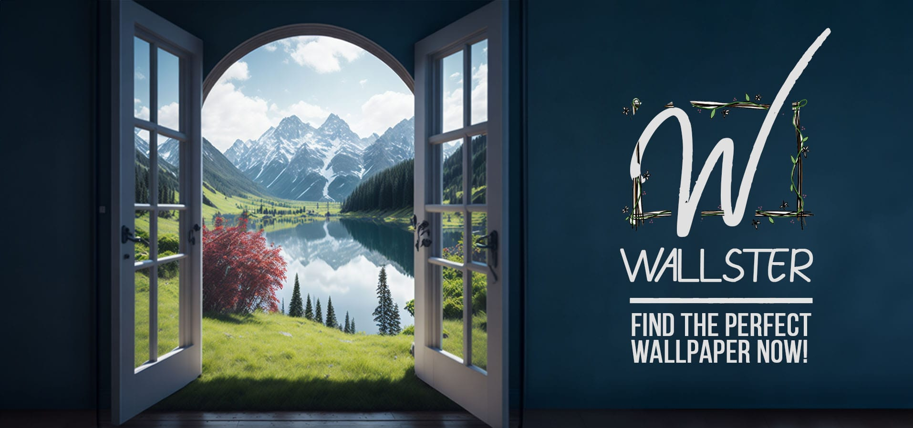

# Wallster

 

## Find the perfect wallpaper! 🖼️

### No longer google "cool desktop wallpapers", just hit the reroll button 🎲
This web-app offers you a (_limitless_) collection of randomly generated wallpapers, **save** the ones you like, **share** them or **reroll** for another shot!

<pre align = "center"> <b> 
<a href="https://dizzydroid.github.com/Wallster">Take me to Wallster!</a> </b>
</pre>

_____________________________

<ins>**DISCLAIMER** </ins>
I do not own/create any of the wallpapers featured on the website, all wallpapers are property of 
<a href = "https://unsplash.com/"><b>Unsplash</b></a> 
______________________________________
### Known issues: 
- The "Get Link" button on the (Share) module does not display an alert when link is copied, but trust me bro, it's copied.
- Loading of images depends highly on internet speed due to a different fetching method used than the one I used to build the site initially.
- The site is not yet optimized for mobile viewing.
- Did I miss any? 👉️ Report any other <a href = "https://github.com/dizzydroid/Wallster/issues"><b>issues</b></a> you encounter!
___________________________________________________________

_____________________________

 This web-app is part of the DizzyBlog © dizzydroid. All rights reserved 

